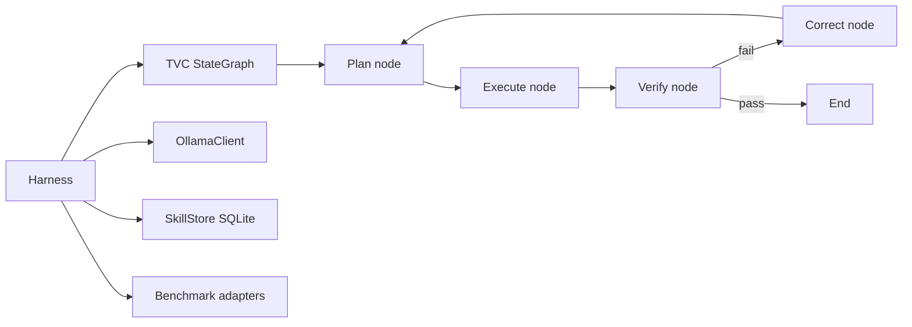

# Kimi-K2.6 Agentic Harness (auto-harness)

Personal research project: a **Test-Verify-Correct (TVC)** agent loop with benchmark gate evaluation, skill memory, and Ollama-backed model execution. Targets SWE-bench, Terminal-Bench 2.0, BrowseComp, and GAIA.

**Repo:** `CleanDevEnvironment/Passion/auto-harness/` · branch `feature/kimi-harness`

**Last commit:** 2026-04-25 · **Tests:** 52/52 passing (core + benchmarks)

## Architecture



**Loop:** plan → execute → verify → [end | correct → plan]

**Checkpointing:** AsyncSqliteSaver persists state between retries

**IPC:** MessagePack over Unix sockets (local) or TCP (remote)

## Components (completed April 2026)

### Benchmark gate system
- Adapters: SWE-bench, Terminal-Bench 2.0, BrowseComp, GAIA (all with mock mode)
- `eval_orchestrator.py` — SOTA comparison + pass/fail gate
- `sota_scores.yaml` — target scores per benchmark
- Full test coverage including gate pass/fail scenarios

### Ollama integration
- `core/model_config.py` — env-configurable URL, model, API key, timeout
- `core/ollama_client.py` — async httpx client for `/api/generate`
- `core/tvc_nodes.py` — model-driven plan (reasoning), execute (shell command), correct (failure analysis)
- `core/harness.py` — owns OllamaClient lifecycle

### Skill store
- SQLite with zstd-compressed traces
- Tag-based retrieval (semantic search planned)

## Environment

```bash
export OLLAMA_BASE_URL="http://localhost:11434"
export OLLAMA_MODEL="kimi-k2.6"
export OLLAMA_TIMEOUT_SECONDS="300"
```

## Remaining work (from docs/next-steps.md)

1. **Harness research** — SWE-agent, AutoCodeRover comparison doc
2. **Production hardening** — streaming, retry/backoff, shell sanitization, structured errors
3. **Real benchmarks** — Docker isolation for SWE-bench, actual datasets for Terminal-Bench/BrowseComp/GAIA
4. **Skill learning** — auto-extract skills from successful traces, embedding-based retrieval
5. **Subagent dispatch** — parent-child session tracking within execute node

## Design decisions to revisit

- Execute node uses `subprocess.run(..., shell=True)` with raw LLM output — security boundary needs hardening
- All adapters default to mock when harness is None — need clean real-eval switch
- Hand-written prompts may need kimi-k2.6-specific tuning

## Parallels to other wiki systems

| Pattern | auto-harness | Wiki equivalent |
|---------|--------------|-----------------|
| Provider abstraction | OllamaClient | [[architectures/provider-adapter-pattern.md]] |
| Async eval harness | Benchmark gate | [[kaggle/arc-agi-benchmarking.md]] |
| Feedback loop | TVC correct node | [[architectures/agentic-trading-system.md]] |

## Interview angles

- **Benchmark-driven development:** Gate pass/fail before merging agent changes
- **TVC vs ReAct:** Explicit verify + correct loop for failure recovery
- **Mock-first adapters:** Test orchestration logic without expensive model runs
