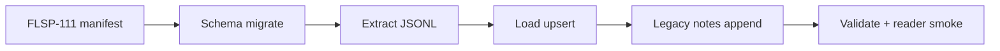

# Pilot Database Migration — NetSuite + Legacy → Postgres

One-time ETL pipeline to populate a **non-prod Postgres pilot database** with NetSuite customer/transaction/inventory data plus legacy notes from iSeries/Memphian — enabling v1 development without live NetSuite sync.

**Jira:** [FLSP-232 Define Testing Database](https://furniturelandsouth.atlassian.net/browse/FLSP-232) (In Progress) · depends on [FLSP-111](https://furniturelandsouth.atlassian.net/browse/FLSP-111) (Done)

**Repo:** `NetSuite/Inventory-Lookup/` — `migration/`, `scripts/migrate.ts`, `lib/migration/`, `docs/migration/`

## Design principles

| Principle | Meaning |
|-----------|---------|
| One-time load | On-demand ETL, not continuous bi-directional sync |
| Pilot scope | Customer first; transactions/inventory derived from transaction lines in pilot window |
| Dual IDs | App UUID + NetSuite internal ID on every migrated row |
| Safe re-runs | Upserts + `UNIQUE (source, external_key)` on notes |
| PII discipline | Staging JSONL gitignored, ephemeral (delete within 7 days) |

## Data sources

1. **NetSuite** — SuiteQL extract via JWT credentials
   - Customers filtered by `lastmodifieddate` in pilot window
   - Transactions filtered by `trandate` (all inventory-bearing types)
   - Inventory snapshot: serials appearing on transaction lines only (not full `inventorynumber` export)

2. **Legacy iSeries / Memphian** — ODBC from Windows System DSN
   - Tables: `QS36F.NSCMTINT`, `QS36F.DMGCMTPF`
   - Memphian = live query app already wired to those tables

## Pilot window (default)

| Env var | Default |
|---------|---------|
| `MIGRATION_SINCE_DATE` | `2025-03-01` |
| `MIGRATION_UNTIL_DATE` | `2025-04-01` |

Both NetSuite and IBM i extracts use the same ISO range (exclusive end).

## Pipeline phases

**CLI:** `npx tsx scripts/migrate.ts {count|extract|load|validate|notes}`

When `DATA_SOURCE=db`, **all API routes read Postgres only** — no live SuiteQL at runtime.

## Entity mapping (from FLSP-232 spec)

| NetSuite entity | Target | Notes |
|-----------------|--------|-------|
| Customer | Accounts + contacts | Preserve NS internal ID for future linking |
| Transaction | Transaction + line items | Currency/date alignment rules |
| Custom record types | Domain tables | Per FLSP-111 sign-off |
| Legacy notes | Notes table | Deterministic matching by entity keys |

## Acceptance criteria (from Jira)

- [ ] FLSP-111 field list approved
- [ ] Field-level mapping doc published
- [ ] Pilot DB populated for v1 use cases without manual data entry
- [ ] Legacy notes associated for representative entity subset
- [ ] Stakeholder sign-off on data shape
- [ ] Gaps documented with follow-up tickets

## Risks

- NetSuite data quality vs app assumptions may require transformation
- Inconsistent identifiers across NS / app / legacy may block automatic note matching
- Schema changes during v1 require repeatable non-prod re-runs
- FLSP-111 changes after mapping lock require migration rework

## Cameron's role

Authored the full FLSP-232 Jira specification (2026-05-19): scope boundaries, requirements, mapping table, legacy notes approach, acceptance criteria, risk register. Implementation co-located with Inventory Lookup app.

## Interview angles

- **Migration vs sync decision:** Explicit one-time load boundary prevents premature integration complexity
- **Dual-ID strategy:** Enables future live sync without breaking pilot referential integrity
- **Multi-source ETL:** NetSuite REST + iSeries ODBC + deterministic note matching
